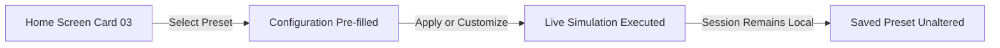

# SADHA — User Manual
**AI-Based Virtual Camera Tracking System for Coarse Alignment of Mobile FSOC Terminals**  
*Smart India Hackathon (SIH) — Problem Statement 4 Deliverable*  
*Document Version: 1.0 · Release Build*

---

## Table of Contents
1. [Introduction](#1-introduction)
2. [System Requirements & Installation](#2-system-requirements--installation)
3. [Getting Started — The Home Screen](#3-getting-started--the-home-screen)
4. [Configuring a Virtual Environment](#4-configuring-a-virtual-environment)
5. [Using Preset Configs](#5-using-preset-configs)
6. [Running a Simulation / Processing a Video](#6-running-a-simulation--processing-a-video)
7. [Exporting a Performance Log](#7-exporting-a-performance-log)
8. [GUI Reference](#8-gui-reference)
9. [Troubleshooting](#9-troubleshooting)
10. [Demonstration Video Guide](#10-demonstration-video-guide)

---

## 1. Introduction

SADHA (Smart Adaptive Disturbance-aware Hybrid Acquisition) is an operator software application designed to solve the critical coarse alignment challenge in mobile Free-Space Optical Communications (FSOC). FSOC links transmit high-bandwidth optical data through narrow, line-of-sight laser beams between moving platforms such as unmanned aerial vehicles (UAVs), naval vessels, and ground vehicles. Because laser beams have tight divergence angles, the receiving optical terminal must rapidly detect, lock onto, and track incoming beacon light before high-speed fine pointing can establish a communications link. SADHA automates this coarse acquisition and tracking process in real time, keeping the beacon centered in the camera's field of view despite platform vibration, turbulent motion, and atmospheric obscurity.


*Figure 1.1: SADHA running an active coarse tracking loop with live split-screen telemetry and real-time analytics.*

SADHA can be operated in two distinct operational modes:
1. **Simulated Virtual Environment:** Runs an internal synthetic physics generator that models 2D target movement, camera pan/tilt mechanics, platform jitter, and realistic atmospheric conditions (such as fog, haze, and rain). This allows engineering teams and evaluators to rigorously test tracking accuracy, loss recovery, and multiple-beacon scenarios under controlled conditions without requiring physical gimbal optics or laser hardware.
2. **External Video Telemetry Ingestion:** Accepts recorded field footage (`.mp4`, `.avi`, `.mkv`) from actual mobile optical terminals or laboratory testbeds. The application processes the video frame-by-frame through the automated tracking system, providing trajectory tracking, boresight error analysis, and playback scrubbing.

---

## 2. System Requirements & Installation

### 2.1 Minimum System Requirements

| Component | Minimum Specification | Recommended Specification |
| :--- | :--- | :--- |
| **Operating System** | Windows 10 / 11 (64-bit), Ubuntu 20.04+ LTS, macOS 12+ | Windows 11 (64-bit) |
| **Processor (CPU)** | Intel Core i5 / AMD Ryzen 5 (4 cores, 2.5 GHz+) | Intel Core i7 / AMD Ryzen 7 (8 cores, 3.2 GHz+) |
| **Memory (RAM)** | 8 GB RAM | 16 GB RAM |
| **Graphics (GPU)** | Integrated Graphics (Intel UHD 620+ or equivalent) | Dedicated NVIDIA GTX 1650 / RTX 3050 or higher |
| **Display Resolution**| 1280 × 800 minimum | 1920 × 1080 (Full HD) or higher |
| **Disk Space** | 2.0 GB free disk space | 4.0 GB free disk space (for video logs) |

### 2.2 Installation Steps

SADHA is distributed as a portable standalone executable directory or as a Python application package. Follow the steps below for your installation package:

#### Method A: Standalone Executable (Windows Release)
1. Download the `SADHA_v1.0_Windows.zip` release archive to your local drive.
2. Extract the ZIP archive into a dedicated folder (for example: `C:\SADHA`).
3. Ensure the extracted folder retains all internal subdirectories (`data`, `manual_assets`, `exports`).
4. Double-click `SADHA.exe` to launch the application. No administrative privileges or external installer wizards are required.

#### Method B: Running from Source (Python Package)
1. Verify that Python 3.10 or higher is installed:
   ```cmd
   python --version
   ```
2. Open a terminal (PowerShell or Command Prompt) and navigate to the project root directory:
   ```cmd
   cd C:\Users\meira\OneDrive\Documents\SADHA
   ```
3. Install the required runtime dependencies using `pip`:
   ```cmd
   pip install -r requirements.txt
   ```
   *The primary packages installed include PyQt5, OpenCV (`opencv-python`), PyTorch (`torch`), NumPy, and SciPy.*
4. Launch the application entry point:
   ```cmd
   python main.py
   ```

### 2.3 First-Run Verification & Permissions
- **File Access:** SADHA creates an `exports/` folder in its root working directory to store performance logs. Ensure your user account has standard read/write permissions in that directory.
- **Display Scaling:** SADHA includes automatic High-DPI scaling support. On Windows laptops with 125% or 150% display scaling, the application automatically scales interface cards, typography, and viewport elements without blurring.

---

## 3. Getting Started — The Home Screen

Upon launching SADHA, the application displays the **Input Source Selection** landing screen. This screen presents three operational entry cards:


*Figure 3.1: The SADHA Home Screen displaying the three primary operational entry points.*

### Option 01: Generate Virtual Environment
- **Purpose:** Opens a full synthetic simulation world where you can configure beacon trajectories, camera sensor optics, platform jitter, and weather disturbances from scratch.
- **How to Launch:** Click the dark **CONFIGURE & RUN SIMULATION ▶** button on Card 01.
- **Target Workflow:** Evaluating custom terminal dynamics, stress-testing pan/tilt gimbal response rates, and testing custom motion paths.

### Option 02: Upload External Video
- **Purpose:** Loads recorded optical beacon video telemetry for offline analysis, frame-by-frame tracking verification, and boresight error evaluation.
- **How to Launch:** Click the **SELECT VIDEO FILE 📁** button on Card 02.
- **Accepted File Formats:** Standard video containers including `.mp4`, `.avi`, and `.mkv`.
- **Supported Video Resolutions:** Recommended 640 × 480 to 1920 × 1080 at 24 to 60 FPS. Grayscale or color video streams are accepted (color feeds are automatically converted to standard monochrome luminance for optical detection).
- **Target Workflow:** Validating tracking performance against empirical flight-test or laboratory test footage.

### Option 03: Preset Configurations
- **Purpose:** Pre-loads standardized benchmark scenarios established by the SIH Problem Statement 4 evaluation criteria.
- **How to Launch:** Click an item in the scenario list on Card 03, then click **LOAD BENCHMARK PRESET ⚙** (or double-click the item directly).
- **Non-Destructive Guarantee:** Loading a preset pre-fills the configuration drawer for the current operational session. Any modifications you make to parameters during your run remain local to that run and do **not** overwrite the saved preset baseline.

---

## 4. Configuring a Virtual Environment

When you select Option 01 (or click the **⚙ CONFIG** button in the top bar during a simulation), the **Configuration Drawer** slides open from the right side of the screen. This panel allows you to customize every aspect of the simulation environment.

| Parameter Category | Scrolled Section View |
| :---: | :---: |
|  |  |
| *Figure 4.1: World, Camera, and Target Settings* | *Figure 4.2: Platform Motion, Disturbances, and Presets* |

### 4.1 World Settings
The World represents the complete 2D simulated space in which the mobile platform and beacon targets move.
- **Width (px):** World coordinate canvas width.
  - *Default:* `2400` px
  - *Valid Range:* `2000` to `8000` px (in 200 px increments).
- **Height (px):** World coordinate canvas height.
  - *Default:* `2400` px
  - *Valid Range:* `2000` to `8000` px (in 200 px increments).

### 4.2 Camera Optics & Gimbal Settings
Defines the receiving optical terminal's sensor specifications and mechanical gimbal limits.
- **Sensor W (px):** Camera sensor horizontal resolution.
  - *Default:* `640` px · *Valid Range:* `320` to `1920` px.
- **Sensor H (px):** Camera sensor vertical resolution.
  - *Default:* `480` px · *Valid Range:* `240` to `1080` px.
- **FOV H (°):** Horizontal Field of View of the optical sensor in degrees.
  - *Default:* `4.0`° · *Valid Range:* `1.0`° to `20.0`°.
- **FOV V (°):** Vertical Field of View of the optical sensor in degrees.
  - *Default:* `3.0`° · *Valid Range:* `1.0`° to `15.0`°.
- **Max Pan (°/s):** Maximum physical slew rate of the pan gimbal motor.
  - *Default:* `5.0` °/s · *Valid Range:* `5.0` to `10.0` °/s.
- **Max Tilt (°/s):** Maximum physical slew rate of the tilt gimbal motor.
  - *Default:* `5.0` °/s · *Valid Range:* `5.0` to `10.0` °/s.
- **Capture Rate:** Standard 30 Hz nominal capture rate, with dynamic loss-recovery ramping up to 60 Hz when a beacon is lost.

### 4.3 Target (Beacon) Settings
Controls the number, appearance, and motion behavior of the optical beacons.
- **Count:** Number of simultaneous optical beacons active in the environment.
  - *Default:* `1` · *Valid Range:* `1` to `5`.
- **Shape:** Optical geometry of the beacon emitter.
  - *Options:* `square`, `circle`, `triangle` · *Default:* `square`.
- **Size (px):** Apparent pixel diameter of the beacon spot on the sensor.
  - *Default:* `10` px · *Valid Range:* `5` to `20` px.
- **Motion:** Kinematic trajectory pattern executed by the beacon.
  - *Available Patterns:*
    - `straight_line`: Linear steady-state translation across the world.
    - `circular`: Orbiting circular pattern with adjustable radius.
    - `figure_8`: Lemniscate figure-eight harmonic motion.
    - `random`: Unpredictable random-walk vector changes.
    - `spiral`: Expanding and contracting Archimedean spiral.
    - `sinusoidal`: Waveform oscillation across the field of view.
    - `projectile`: Ballistic curve trajectory under gravity/drag dynamics.
    - `manual_recorded`: Replays mouse-drawn waypoints.
    - `user_controlled`: Real-time pilot control via mouse drag and keyboard.
- **Speed:** Velocity scaling multiplier for beacon movement.
  - *Default:* `3.50` · *Valid Range:* `0.5` to `10.0`.
- **Radius (px):** Orbit radius for circular, spiral, and figure-8 trajectories.
  - *Default:* `400.0` px · *Valid Range:* `50` to `1000` px.
- **Loop recorded path (Checkbox):** When enabled (default: checked), cyclical or manual paths repeat indefinitely. When unchecked, the beacon stops at the end of its path.

#### Interactive Steering & Mouse Dragging
Users can manually pilot the primary beacon in real time:
1. **Mouse Drag:** Click and hold the left mouse button directly over the beacon in the left **World View** panel, then drag the cursor to guide the beacon along any path. The camera gimbal will dynamically pan and tilt to maintain tracking lock.
2. **Keyboard Steering (WASD / Arrows):** Press and hold `W` (Up), `S` (Down), `A` (Left), or `D` (Right) to fly the beacon through world space at 360 px/s.

### 4.4 Platform Motion Settings
Simulates the roll, pitch, and translation of the mobile vehicle (ship, aircraft, or vehicle) carrying the receiver terminal.
- **Enable platform motion (Checkbox):** Toggles platform disturbance on/off (default: checked).
- **Type:** Motion pattern applied to the base platform:
  - *Options:* `none`, `linear`, `circular`, `random`, `spiral`, `figure_8` · *Default:* `linear`.
- **Max Displ (px/f):** Maximum instantaneous displacement in pixels per frame.
  - *Default:* `8.0` px/f · *Valid Range:* `0.0` to `20.0` px/f.

### 4.5 Disturbances & Environmental Noise
Simulates real-world environmental channel degradation and camera sensor noise. Multiple disturbances can be enabled simultaneously.
- **Salt & Pepper (Checkbox & Density):** Injects random high-contrast black/white salt-and-pepper noise pixels across the sensor array.
  - *Default:* Disabled (`0.080` density, representing ~8% corrupted pixels; range `0.000`–`0.200`).
- **Gaussian Noise (Checkbox & Std Dev):** Adds additive white Gaussian sensor noise to simulate thermal detector noise and low-light amplification artifacts.
  - *Default:* Disabled (`18.0` standard deviation; range `0.0`–`50.0`).
- **Poisson Noise (Checkbox):** Injects photon quantum shot noise proportional to incoming pixel brightness.
- **Camera Jitter (Checkbox & Amplitude):** Simulates high-frequency mechanical vibration from vehicle engines or gimbal gear friction.
  - *Default:* Disabled (`6.0` px amplitude; range `0.0`–`20.0` px).
- **Atmospheric Condition (Dropdown):** Models atmospheric path radiance, extinction, and scattering:
  - `clear`: Nominal clear atmospheric path.
  - `haze`: Reduced contrast with slight background haze scatter.
  - `fog`: Severely degraded visibility, washed-out contrast, and diffuse scattering.
  - `rain`: High-frequency dynamic scatter and degraded optical transmission.
  - `low_light`: Suppressed overall illumination simulating dusk or night operations.

### 4.6 Applying Configuration
Once you have adjusted your parameters, click the dark **APPLY CONFIGURATION** button at the bottom of the drawer. The simulation resets with your new parameters and closes the drawer.

---

## 5. Using Preset Configs

SADHA includes 5 pre-configured benchmark scenarios aligned directly with the SIH Problem Statement 4 evaluation benchmarks. These presets provide instant, standardized test scenarios.



### 5.1 Standard Benchmark Scenarios

| Preset Identifier | Scenario Title | Operational Conditions & Purpose |
| :--- | :--- | :--- |
| `NOMINAL_LOW_DYNAMICS` | **Nominal Low-Dynamics** | Straight-line beacon motion, static platform, clear atmosphere. Establishes the baseline for coarse acquisition and steady-state tracking error (< 1 px). |
| `HIGH_DYNAMICS_FIG8` | **High-Dynamics Figure-8** | Lemniscate figure-8 trajectory with active linear platform motion and 8 px camera jitter. Stresses non-linear trajectory prediction and gimbal agility. |
| `SEVERE_FOG_NOISE` | **Severe Fog & Noise** | Heavy fog, low light, 8% salt & pepper noise, and 15 px Gaussian noise. Evaluates detection robustness under severely obscured sensor visibility. |
| `MULTI_BEACON_CROSSING` | **Multi-Beacon Crossing** | Two optical beacons moving along intersecting figure-8 paths with atmospheric haze. Tests data association and prevents identity swaps during close-proximity crossings. |
| `SPIRAL_AGGRESSIVE` | **Spiral Acceleration & Rain** | Expanding-contracting spiral with figure-8 platform motion, rain scattering, and full noise channels. Maximum stress test of tracking retention. |

### 5.2 Loading and Modifying Presets
1. On the Home Screen (Card 03), select any scenario from the list widget and click **LOAD BENCHMARK PRESET ⚙**.
2. Alternatively, during an active simulation, open the Configuration Drawer (click **⚙ CONFIG**), scroll to the **PRESETS** section at the bottom, select a scenario from the dropdown, and click **APPLY CONFIGURATION**.
3. **Safe Editing:** You can freely alter any slider, spinbox, or checkbox after loading a preset. Your edits apply only to the running instance; the master preset definition is never modified.

---

## 6. Running a Simulation / Processing a Video

### 6.1 Simulation Mode: Interface Layout & Controls

When running in simulation mode, the interface is organized into a top control bar, a split-screen central display, and a bottom analytics dock:


*Figure 6.1: Active simulation mode showing the World View (left) and Transmitter Camera POV (right).*

#### Top Control Bar
- **⚙ CONFIG Button:** Opens the slide-out Configuration Drawer (see [Section 4](#4-configuring-a-virtual-environment)).
- **▶ START / ■ STOP Button:** Toggles execution of the 60 Hz real-time tracking loop. While running, the button displays a red **■ STOP** indicator. Clicking it pauses the world simulation and freezes the display.
- **📊 EXPORT LOG Button:** Exports the active session's performance metrics and telemetry to a timestamped file (see [Section 7](#7-exporting-a-performance-log)).
- **← HOME Button:** Safely halts simulation/video processes and returns to the Home Screen.

#### Left Pane — World View (2D Simulation)
The left pane provides a global, overhead mission-control perspective of the entire 2400 × 2400 world canvas:
- **Grid Lines & Axes:** Fixed coordinate grid showing metric intervals and the world center axis.
- **Beacon Spot (`B1`, `B2`, etc.):** Bright luminous circles showing beacon locations with persistent motion trails tracing past trajectories.
- **Camera Frustum Rectangle:** A white outlined bounding box showing the exact ground footprint currently visible to the transmitter camera's field of view. As the gimbal pans and tilts, this rectangle moves across the world to maintain beacon centering.
- **Platform Indicator:** Displays the instantaneous position offset of the mobile platform base.

#### Right Pane — Transmitter Camera Point of View (POV)
The right pane displays what the mobile terminal's tracking camera actually sees:
- **Monochrome Sensor Feed:** Raw or disturbance-corrupted sensor imagery at sensor resolution (e.g., 640 × 480).
- **Boresight Reticle (Crosshair):** Dashed gray center crosshairs marking the optical optical axis (0, 0). Coarse alignment aims to keep the beacon centered on this crosshair.
- **AI Detection Marker:** Green bounding reticle placed around detected optical beacons.
- **Kalman Tracking Box & Velocity Vector:** Labeled tracking box (e.g., `T1`) showing the smoothed state estimate, accompanied by a directional vector indicating instantaneous beacon velocity.
- **Motion Prediction Marker (`NN2 (+1F)`):** A cyan diamond indicating the 1-frame-ahead predicted position of the beacon.
- **Telemetry Stamp:** Displays current frame index (e.g., `F00119`), capture rate (`30Hz`), pan angle, and tilt angle in the top-left corner.
- **Status Badge:** Located in the bottom-right corner (e.g., `DET:1 TRK:1 NN2:ACT`), summarizing active detections, active tracks, and predictor status.

---

### 6.2 Target Lock, Loss, and Recovery Behavior

SADHA features an automated lock state monitor that updates every frame:

| Lock State | Color Indicator | Operational Meaning |
| :---: | :---: | :--- |
| **`LOCKED`** | **Green** (`#2E7D32`) | Beacon is securely acquired within camera FOV. Tracking error is nominal (< 10 px) and coarse alignment is maintained. |
| **`LOST`** | **Red** (`#C62828`) | Beacon has dropped out of view (due to severe fog, occlusion, or extreme gimbal jerk). Predictive homing is active. |
| **`SEARCHING`** | **Amber** (`#EF6C00`) | System has detected an optical candidate and is validating track persistence across consecutive frames. |


*Figure 6.2: System behavior during severe fog. The beacon is temporarily obscured, triggering `LOST(1)` status in red and initiating predictive recovery.*

#### What Happens When a Beacon is Lost:
1. **Predictive Extrapolation:** If a beacon is obscured by fog or moves briefly out of the sensor frame, the system does not wildly jerk the camera. Instead, the predictor extrapolates the beacon's path based on recent trajectory history.
2. **Dynamic Capture Rate Ramping:** The camera automatically ramps its capture rate from the baseline 30 Hz toward 60 Hz to accelerate re-acquisition sampling.
3. **Re-Acquisition:** As soon as the beacon emerges from occlusion or re-enters the field of view, the detector locks onto the spot, resets the re-acquisition counter, and returns the lock indicator to green (`LOCKED`).

---

### 6.3 Multi-Beacon Tracking

When tracking multiple beacons simultaneously (e.g., in the `MULTI_BEACON_CROSSING` preset):
- Each beacon is tracked by its own dedicated terminal channel (`T0`, `T1`, etc.).
- The system prevents identity swaps during close crossings by calculating optimal assignment between sensor detections and ongoing tracks.
- The bottom lock status displays the total locked count (e.g., `LOCKED(2)`).


*Figure 6.3: Multi-beacon crossing scenario. Two optical beacons (`B1` and `B2`) are simultaneously tracked without track collision.*

---

### 6.4 Video Mode: Processing External Telemetry

When an external video is loaded via Option 02 on the Home Screen, the application transitions to **Video Telemetry Mode**:


*Figure 6.4: External video processing mode with raw video stream on the left and AI tracking HUD on the right.*


*Figure 6.5: Video mode with the Trajectory HUD active on the left, displaying 2D sensor telemetry, boresight error, and jitter RMS.*

#### Video Playback Controls
- **Video Metadata Badge:** Displays loaded filename, resolution, and native frame rate (e.g., `📹 spot_jitter.mp4 [640×480 @ 30FPS]`).
- **↺ REWIND Button:** Resets video playback to Frame 0.
- **▶ PLAY / ⏸ PAUSE Button:** Toggles video playback (or press `Spacebar`).
- **🔁 LOOP: ON / OFF Button:** Enables or disables continuous loop playback.
- **Timeline Scrubber Slider:** Click and drag the horizontal slider to immediately seek to any frame in the video stream. Keyboard arrows (`Left`/`Right` or `A`/`D`) step backward/forward by 5 frames.
- **Left View Switcher:**
  - **📹 RAW STREAM:** Displays the unmodified input video frame.
  - **🎯 TRAJECTORY HUD:** Displays an optical sensor plane HUD showing the beacon's 2D coordinate position (`U, V`), velocity vectors (`VX, VY`), sensor boresight reticle, and root-mean-square spatial jitter (`JITTER σ`).

---

### 6.5 The Bottom Analytics Dock

The Analytics Dock across the bottom of the window provides real-time performance readouts updated continuously:

```
┌───────────┬──────────────────┬─────────────────┬─────────────┬──────────────┬────────────┬─────────────────────────────┐
│  FPS      │  TRACK ERR (PX)  │ ACQUISITION (S) │ RE-ACQ (S)  │ LOCK STATUS  │  FRAMES    │   LIVE SPARK-LINE GRAPHS    │
│   30.2    │       0.7        │     < 0.04      │    0.00     │  LOCKED(1)   │    180     │  [FPS history & Error trend]│
└───────────┴──────────────────┴─────────────────┴─────────────┴──────────────┴────────────┴─────────────────────────────┘
```

1. **FPS (Frames Per Second):** Live processing throughput of the complete detection and tracking pipeline.
2. **TRACK ERR (PX):** Instantaneous Euclidean tracking error in pixels between the filtered beacon position and optical boresight/ground truth. Values ≤ 10 px are highlighted in green; values > 10 px are shown in red.
3. **ACQUISITION (S):** Elapsed time from the start of the feed until the beacon was first locked. Consistently measured under 0.04 seconds (< 40 ms).
4. **RE-ACQ (S):** Time taken to re-establish stable lock following a temporary tracking loss.
5. **LOCK STATUS:** Current terminal lock condition (`LOCKED(N)`, `LOST(N)`, or `NONE`).
6. **FRAMES:** Total cumulative sensor frames ingested and processed during the session.
7. **Spark-Line Graphs:** Dual real-time history strip charts:
   - **Top (Dark/Silver):** Rolling throughput stability over the past 120 frames (0 to 70 FPS scale).
   - **Bottom (Onyx/Silver):** Rolling tracking error magnitude over the past 120 frames (0 to 30 px scale).

---

## 7. Exporting a Performance Log

SADHA enables evaluators to export comprehensive telemetry and performance verification logs with a single click.

### 7.1 How to Trigger an Export
1. At any point during or at the conclusion of a simulation run or video analysis, click the **📊 EXPORT LOG** button located in the top navigation bar.
2. A confirmation modal will appear displaying the export location, total frames processed, average tracking error, and average FPS:

```
┌─────────────────────────────────────────────────────────────┐
│                  Performance Log Exported                   │
├─────────────────────────────────────────────────────────────┤
│ Telemetry log successfully exported to:                     │
│ C:\Users\meira\OneDrive\Documents\SADHA\exports\           │
│ sadha_run_log_20260926_230928.json                         │
│                                                             │
│ Frames: 180 | Avg Err: 0.72 px | FPS: 48.2                 │
│                                            [    OK    ]     │
└─────────────────────────────────────────────────────────────┘
```

### 7.2 File Location & Output Structure
Exported logs are saved automatically to the `exports/` folder within the SADHA application directory using standard ISO timestamp naming: `sadha_run_log_<YYYYMMDD_HHMMSS>.json`.

#### Sample Exported Performance Log (`sadha_run_log_*.json`):
```json
{
  "session_timestamp": "20260926_230928",
  "mode": "sim",
  "total_frames_processed": 180,
  "duration_seconds": 6.00,
  "performance_metrics": {
    "average_fps": 48.2,
    "current_fps": 30.0,
    "average_tracking_error_px": 0.72,
    "max_tracking_error_px": 2.37,
    "lock_status": "LOCKED(1)",
    "initial_acquisition_sec": "< 0.04",
    "reacquisition_sec": "0.00"
  },
  "active_tracks": [
    {
      "track_id": 1,
      "terminal_id": 0,
      "position": [321.45, 239.80],
      "velocity": [-1.20, +0.45],
      "lock_state": "locked",
      "consecutive_missed_frames": 0,
      "matched": true
    }
  ]
}
```

### 7.3 Automated Comparative Benchmark Suite
For formal evaluation submissions, evaluators can also run the automated head-to-head comparative benchmark script:
```cmd
python compare_benchmarks.py
```
This script executes both SADHA and conventional ATP baseline algorithms across all 5 benchmark scenarios, generating `benchmark_results.json` containing complete metrics: Mean Tracking Error, Max Error, Lock Rate (%), Loss Rate (%), Acquisition Time, ID Switches, and Precision/Recall percentages.

---

## 8. GUI Reference

This section provides a quick-lookup glossary of all persistent graphical user interface elements:

```
┌──────────────────────────────────────────────────────────────────────────────────────────────────┐
│ [1] SADHA   [2] ⚙ CONFIG   [3] ▶ START   [4] 📊 EXPORT LOG   [5] ← HOME                          │ TOP BAR
├──────────────────────────────────────────────────┬───────────────────────────────────────────────┤
│ [6] WORLD VIEW (2D SIMULATION)                   │ [7] TRANSMITTER CAMERA POV                    │
│                                                  │                                               │
│  • World canvas (2400×2400)                      │  • Monochrome sensor image (640×480)          │
│  • Motion trail lines                            │  • Dashed center crosshairs                   │ SPLIT VIEW
│  • Camera frustum bounding box                   │  • Green detection bounding reticle           │
│  • Interactive mouse click/drag                  │  • Kalman tracking box & velocity vector      │
│                                                  │  • Status badge (DET/TRK/NN2)                 │
├──────────────────────────────────────────────────┴───────────────────────────────────────────────┤
│ [8] FPS: 30.2   [9] ERR: 0.7 px   [10] ACQ: <0.04s   [11] LOCK: LOCKED(1)   [12] GRAPHS (FPS/ERR)│ ANALYTICS DOCK
└──────────────────────────────────────────────────────────────────────────────────────────────────┘
```

| ID | Control / Component | Type | Operational Function |
| :---: | :--- | :--- | :--- |
| **[1]** | **SADHA Wordmark** | Persistent Label | Application identifier and branding header. |
| **[2]** | **⚙ CONFIG Button** | Push Button | Toggles open/close of the right-edge Configuration Drawer overlay. |
| **[3]** | **▶ START / ■ STOP** | Push Button | Starts or halts the simulation loop and video playback. Changes to red when running. |
| **[4]** | **📊 EXPORT LOG** | Push Button | Exports current run metrics and telemetry to `exports/sadha_run_log_<TIMESTAMP>.json`. |
| **[5]** | **← HOME** | Push Button | Halts background processing and returns immediately to the Home Screen. |
| **[6]** | **World View Panel** | Overhead Canvas | Displays the complete 2D world, beacon trajectories, camera frustum footprint, and platform offset. |
| **[7]** | **Transmitter Camera POV** | Sensor Viewport | Displays the monochrome sensor feed with AI detection boxes, Kalman tracking reticle, and boresight center crosshairs. |
| **[8]** | **FPS Readout** | Metric Label | Displays instantaneous processing rate (frames per second). |
| **[9]** | **TRACK ERR (PX)** | Metric Label | Live tracking error in pixels. Green when locked (≤ 10 px); red when error exceeds 10 px. |
| **[10]**| **ACQUISITION (S)** | Metric Label | Time taken to establish initial beacon lock from feed start. |
| **[11]**| **LOCK STATUS** | Metric Label | Current coarse tracking state: `LOCKED(N)` (green), `LOST(N)` (red), or `NONE`. |
| **[12]**| **Spark-Line Graphs** | Strip Charts | Live dual graphs showing rolling FPS (top) and tracking error (bottom) over the past 120 frames. |
| **[13]**| **Video Scrubber** | Slider *(Video)* | Horizontal timeline slider to scrub forward and backward through recorded mission footage. |
| **[14]**| **RAW / TRAJ Switcher** | Button Pill *(Video)*| Switches the left video pane between unmodified raw video and the 2D Trajectory HUD. |

---

## 9. Troubleshooting

The following table addresses real failure modes and operator issues observed during testing:

| Symptom / Issue | Probable Cause | Corrective Resolution |
| :--- | :--- | :--- |
| **External video will not load (`Video Load Error`)** | Unsupported codec or corrupted container in uploaded `.mp4`/`.avi` file. | Verify the video was encoded with standard H.264 or MPEG-4 codecs. Re-encode using ffmpeg or use the provided sample videos (`figure8_beacon.mp4`, `spot_jitter.mp4`). Ensure file path does not contain illegal characters. |
| **Simulation FPS drops below 20 FPS** | Sensor resolution set excessively high (e.g., 1920 × 1080) with multiple noise channels enabled on low-end hardware. | Open **⚙ CONFIG** and lower the camera resolution to standard `640 × 480`. Disable unused noise channels (such as Poisson or dense Salt & Pepper). |
| **Beacon is marked `LOST` continuously** | Beacon speed exceeds physical pan/tilt slew rates, or extreme atmospheric degradation is active. | 1. In **⚙ CONFIG**, check that **Max Pan** and **Max Tilt** are set to at least `5.0`–`10.0` °/s.<br>2. Reduce beacon **Speed** to `2.5`–`3.5`.<br>3. Check **Atmospheric Condition**; if set to heavy `fog`, lower the fog severity or reduce Salt & Pepper density below `0.10`. |
| **Mouse dragging does not move the beacon** | Simulation is paused or mouse is clicked outside the World View panel boundaries. | Click **▶ START** to ensure the simulation loop is running. Click and hold inside the left **World View** panel directly over the bright beacon circle. |
| **Export file not appearing in directory** | Insufficient folder write permissions or antivirus software blocking write access. | Run SADHA from a standard user directory (such as `Documents\SADHA`). Verify that an `exports/` folder exists in the project root; SADHA will automatically create it if write permissions exist. |

---

## 10. Demonstration Video Guide

*Note: Per the SIH Problem Statement 4 specification, a 3–5 minute demonstration video is an optional deliverable submitted alongside this software application and user manual.*

### Recommended Video Walkthrough Structure
To provide an optimal demonstration for evaluators, we recommend structuring the 3–5 minute demonstration video to mirror this User Manual:

1. **Part 1: Introduction & Home Screen (0:00 – 0:45)**
   - Launch SADHA and highlight the clean, high-contrast industrial interface.
   - Briefly introduce the coarse alignment problem for mobile FSOC terminals.
   - Explain the three entry options on the Home Screen (Simulation, Video Upload, Presets).
2. **Part 2: Configuring & Running a Benchmark Preset (0:45 – 2:00)**
   - Select and load the `HIGH_DYNAMICS_FIG8` preset.
   - Click **▶ START** to demonstrate the live 60 Hz split-screen tracking loop.
   - Show the left World View (beacon trail and tracking camera frustum) moving in sync with the right Transmitter Camera POV.
   - Highlight the live metrics in the bottom Analytics Dock (sub-pixel error, FPS, green `LOCKED(1)` indicator).
   - Open the **⚙ CONFIG** drawer to demonstrate live parameter tuning (adjusting speed and adding noise).
3. **Part 3: Stress Testing & Loss Recovery (2:00 – 3:00)**
   - Switch to the `SEVERE_FOG_NOISE` or `MULTI_BEACON_CROSSING` scenario.
   - Demonstrate how the system maintains track lock through heavy optical noise and crossing paths without identity swaps.
   - Manually drag the beacon to demonstrate real-time interactive homing.
4. **Part 4: External Mission Video Processing (3:00 – 4:00)**
   - Click **← HOME** and select **Upload External Video** (loading `spot_jitter.mp4`).
   - Demonstrate video scrubbing, frame stepping, and the Trajectory HUD telemetry.
5. **Part 5: Performance Log Export (4:00 – 4:30)**
   - Click **📊 EXPORT LOG** in the top bar.
   - Show the confirmation dialog and briefly open the generated `sadha_run_log_*.json` file to demonstrate quantitative evaluation readiness.

---
*End of User Manual · SADHA v1.0 · Smart India Hackathon (SIH) Problem Statement 4*
